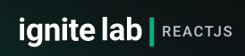

<h1 align="center">
  <br /><br />
</h1>

<h3 align="center">
  Event Platform - A easy way to show your lessons in an event
</h3>

<p align="center">
  

  <a href="https://www.linkedin.com/in/luishng/">
    
  </a>
  
  
  
  <a href="https://github.com/luishng/event-platform/commits/master">
    
  </a>
  
  <a href="https://github.com/luishng/event-platform/issues">
    
  </a>
  
  
</p>

# 📍 Table of Contents

<p align="center">
  <a href="#recycle-about-the-project">About the project</a>&nbsp;&nbsp;&nbsp;|&nbsp;&nbsp;&nbsp;
  <a href="#-technologies">Technologies</a>&nbsp;&nbsp;&nbsp;|&nbsp;&nbsp;&nbsp;
  <a href="#-getting-started">Getting Started</a>&nbsp;&nbsp;&nbsp;|&nbsp;&nbsp;&nbsp;
  <a href="#-features">Features</a>&nbsp;&nbsp;&nbsp;|&nbsp;&nbsp;&nbsp;
  <a href="#-license">License</a>
</p>

## 📸 About the project

This software provides a registration in GraphCMS, where the owner of the event can show your lessons in videos and share challenges.

## 🚀 Technologies

- [JavaScript](https://www.javascript.com/)
- [TypeScript](https://www.typescriptlang.org/)

- [ReactJS](https://reactjs.org/)
- [GraphCMS](https://hygraph.com/)
- [GraphQL](https://graphql.org/)
- [Apollo](https://www.apollographql.com/)


## 🔗 Features

- Register users by email and password
- Register videos
- Show date of the lessons
- Share challenges for clients in lessons

## 🏁 Getting Started

**Install the requirements**

- [Git](https://git-scm.com/)
- [npm](https://www.npmjs.com/)

**Clone the project and access the folder**

```bash
$ git clone https://github.com/luishng/event-platform.git && cd gobarber
```
**Follow the steps below for installation**
### Web

_PS: Before to continue, be sure to have the API running_

```bash
# Install the dependencies
$ npm i

# Start the client
$ npm run dev
```

## 📝 License

This project is licensed under the MIT License - see the [LICENSE](LICENSE) file for details.

---

Made with 💙&nbsp; by [Luis Henrique](https://github.com/luishng) 👋 &nbsp;[See my linkedin](https://www.linkedin.com/in/luishng/) 👷